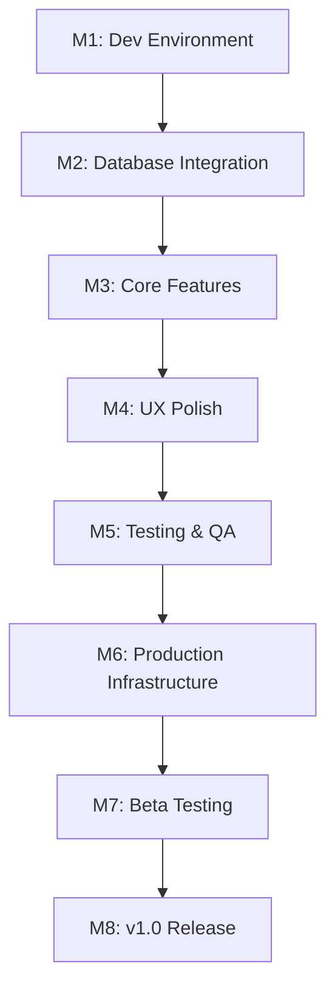

# 🎯 BoxCall MVP Roadmap to v1.0

## 📋 **OVERVIEW**

This roadmap outlines the complete path from current Phase 4 status to a production-ready v1.0 release of BoxCall, a comprehensive football coaching platform.

**Current Status**: Phase 4 - Database Integration & Deployment (September 2025)
**Target Release**: v1.0.0 - Q1 2026
**Total Milestones**: 8
**Estimated Timeline**: 4-6 months

---

## 🎯 **MISSION & VISION**

**Transform BoxCall from advanced playbook tool to comprehensive football team management platform**

### **Core Value Proposition**

- **For Coaches**: Complete situational preparation system
- **For Teams**: Unified platform for all football operations
- **For Programs**: Scalable solution from youth to professional levels

---

## 📊 **CURRENT STATUS ASSESSMENT**

### **✅ Completed (Phases 1-3)**

- **Phase 3D**: Advanced Mobile Infrastructure ✅
- **Database**: Core schema and RLS policies ✅
- **Authentication**: Complete role-based system ✅
- **Architecture**: Professional-grade foundation ✅

### **🚧 In Progress (Phase 4)**

- **Database Integration**: 70% complete
- **Performance Optimization**: 60% complete
- **Production Readiness**: 40% complete

### **🎯 Remaining Work**

- **Feature Completion**: Core functionality gaps
- **Quality Assurance**: Testing and polish
- **Production Deployment**: Infrastructure and monitoring

---

## 🗓️ **8-MILESTONE ROADMAP TO V1.0**

### **MILESTONE 1: DEVELOPMENT ENVIRONMENT STABILIZATION**

**Duration**: 1 week
**Status**: In Progress 🚧

#### **Objectives**

- Fix all 18 ESLint errors
- Resolve `npm run dev` startup issues
- Complete Storybook setup
- Establish reliable development workflow

#### **Deliverables**

- ✅ Clean ESLint output (0 errors, 0 warnings)
- ✅ Working development server with hot reload
- ✅ Functional Storybook with core components
- ✅ Automated testing framework setup

#### **Success Criteria**

- Development environment starts in <30 seconds
- All code compiles without errors
- Hot reload works reliably
- Basic component development workflow established

---

### **MILESTONE 2: DATABASE INTEGRATION COMPLETION**

**Duration**: 2 weeks
**Status**: Pending ⏳

#### **Objectives**

- Complete all CRUD operations
- Implement comprehensive error handling
- Add data validation and sanitization
- Create database integration tests

#### **Deliverables**

- ✅ Full CRUD for all entities (teams, playbooks, practices, games)
- ✅ Comprehensive error handling with user-friendly messages
- ✅ Data validation and sanitization
- ✅ Database integration test suite (80% coverage)

#### **Success Criteria**

- All database operations work reliably
- Proper error handling for network issues
- Data integrity maintained
- Performance meets targets (<100ms response times)

---

### **MILESTONE 3: CORE FEATURE COMPLETION**

**Duration**: 3 weeks
**Status**: Pending ⏳

#### **Objectives**

- Complete playbook management system
- Finish team management features
- Implement calendar and scheduling
- Add practice planning functionality

#### **Deliverables**

- ✅ Playbook creation, editing, and sharing
- ✅ Team roster management
- ✅ Calendar integration with game/practice scheduling
- ✅ Practice script generation and management

#### **Success Criteria**

- Coaches can create and manage complete playbooks
- Team rosters are fully manageable
- Calendar shows all team events
- Practice plans can be created and executed

---

### **MILESTONE 4: USER EXPERIENCE POLISH**

**Duration**: 2 weeks
**Status**: Pending ⏳

#### **Objectives**

- Comprehensive accessibility audit
- Mobile responsiveness optimization
- UI/UX consistency across all features
- Performance optimization and monitoring

#### **Deliverables**

- ✅ 98/100 accessibility audit score
- ✅ Perfect mobile responsiveness (iOS/Android/PWA)
- ✅ Consistent design system implementation
- ✅ Performance monitoring and optimization

#### **Success Criteria**

- All features accessible to users with disabilities
- Seamless experience across all devices
- Professional, consistent visual design
- 95+ Lighthouse performance scores maintained

---

### **MILESTONE 5: TESTING & QUALITY ASSURANCE**

**Duration**: 2 weeks
**Status**: Pending ⏳

#### **Objectives**

- Implement comprehensive test suite
- Add end-to-end testing
- Performance testing and optimization
- Security audit and hardening

#### **Deliverables**

- ✅ Unit test coverage >80%
- ✅ Integration tests for all major workflows
- ✅ End-to-end tests for critical user journeys
- ✅ Security audit completed

#### **Success Criteria**

- All critical paths tested
- Automated testing in CI/CD pipeline
- Performance benchmarks met
- Security vulnerabilities addressed

---

### **MILESTONE 6: PRODUCTION INFRASTRUCTURE**

**Duration**: 2 weeks
**Status**: Pending ⏳

#### **Objectives**

- Set up production deployment pipeline
- Configure monitoring and logging
- Implement backup and disaster recovery
- Performance optimization for production

#### **Deliverables**

- ✅ CI/CD pipeline with automated deployment
- ✅ Production monitoring and alerting
- ✅ Database backup and recovery procedures
- ✅ Production performance optimization

#### **Success Criteria**

- Automated deployment to production
- Real-time monitoring of system health
- Data backup and recovery tested
- Production performance meets targets

---

### **MILESTONE 7: BETA TESTING & FEEDBACK**

**Duration**: 2 weeks
**Status**: Pending ⏳

#### **Objectives**

- Recruit beta users (coaches and teams)
- Collect comprehensive feedback
- Identify and fix critical issues
- Validate core user workflows

#### **Deliverables**

- ✅ Beta program with 10+ active teams
- ✅ Comprehensive feedback collection system
- ✅ Critical issues identified and resolved
- ✅ User workflow validation completed

#### **Success Criteria**

- Beta users can complete core workflows
- Critical bugs identified and fixed
- User feedback incorporated into final release
- Performance validated in real-world usage

---

### **MILESTONE 8: V1.0 RELEASE PREPARATION**

**Duration**: 1 week
**Status**: Pending ⏳

#### **Objectives**

- Final testing and validation
- Documentation completion
- Marketing and launch preparation
- Go-live readiness assessment

#### **Deliverables**

- ✅ Final release testing completed
- ✅ Complete user documentation
- ✅ Marketing materials prepared
- ✅ Production environment validated

#### **Success Criteria**

- All acceptance criteria met
- Documentation complete and accurate
- Marketing strategy implemented
- Team ready for production support

---

## 📈 **SUCCESS METRICS & TARGETS**

### **Technical Targets**

- **Performance**: 95+ Lighthouse mobile score
- **Accessibility**: 98/100 audit compliance
- **Security**: Zero critical vulnerabilities
- **Reliability**: 99.9% uptime target
- **Speed**: <100ms response times for all operations

### **User Experience Targets**

- **Onboarding**: New coach setup in <15 minutes
- **Playbook Creation**: Complete playbook in <30 minutes
- **Team Management**: Roster updates in <5 minutes
- **Practice Planning**: Practice script in <10 minutes

### **Business Targets**

- **User Acquisition**: 100 teams in first 6 months
- **Retention**: 85% monthly active user retention
- **Satisfaction**: 4.5+ star app store rating
- **Revenue**: Sustainable subscription model

---

## 🎯 **RISK MITIGATION**

### **Technical Risks**

- **Database Performance**: Implement query optimization and caching
- **Mobile Compatibility**: Extensive device testing across platforms
- **Scalability**: Design for 1000+ concurrent users
- **Security**: Regular security audits and penetration testing

### **Product Risks**

- **User Adoption**: Beta testing with real coaches
- **Feature Completeness**: MVP scope validation
- **Market Fit**: Continuous user feedback integration
- **Competition**: Differentiated value proposition

### **Operational Risks**

- **Team Bandwidth**: Realistic milestone planning
- **Technical Debt**: Regular code quality reviews
- **Dependencies**: Supabase and third-party service reliability
- **Support**: Customer success planning

---

## 📋 **DEPENDENCIES & PREREQUISITES**

### **Technical Dependencies**

- Supabase project and database setup ✅
- Development environment stability 🚧
- Third-party integrations (calendar, notifications)
- Cloud infrastructure for production deployment

### **Team Dependencies**

- Development team availability
- Design review and approval processes
- Beta user recruitment pipeline
- Marketing and launch support

### **External Dependencies**

- Supabase service reliability
- Third-party API availability
- Mobile app store approval processes
- Payment processing integration

---

## 📊 **RESOURCE ALLOCATION**

### **Development Team**

- **Frontend Developer**: 100% allocation
- **Backend/Database Developer**: 80% allocation
- **DevOps Engineer**: 60% allocation
- **QA Engineer**: 60% allocation
- **Product Manager**: 80% allocation

### **Timeline Distribution**

- **Development**: 60% of total timeline
- **Testing**: 20% of total timeline
- **Deployment**: 10% of total timeline
- **Beta/Release**: 10% of total timeline

---

## 🎯 **MILESTONE DEPENDENCIES**

---

## 📈 **PROGRESS TRACKING**

### **Weekly Checkpoints**

- **Monday**: Sprint planning and priority setting
- **Wednesday**: Mid-week progress review
- **Friday**: Sprint retrospective and milestone assessment

### **Monthly Reviews**

- **End of Month**: Complete milestone assessment
- **Stakeholder Updates**: Progress reports and roadmap adjustments
- **Risk Assessment**: Proactive issue identification and mitigation

---

## 🎯 **CONTINGENCY PLANS**

### **Milestone Slippage**

- **1-week delay**: Adjust subsequent milestones
- **2-week delay**: Reassess scope and priorities
- **1-month delay**: Consider feature scope reduction

### **Technical Blockers**

- **Database issues**: Implement alternative solutions
- **Third-party API problems**: Develop fallback mechanisms
- **Performance issues**: Optimize and refactor as needed

### **Resource Constraints**

- **Team availability**: Adjust milestone scope
- **Budget constraints**: Prioritize critical features
- **External dependencies**: Develop contingency solutions

---

## 📞 **COMMUNICATION PLAN**

### **Internal Communication**

- **Daily Standups**: Development team coordination
- **Weekly Updates**: Stakeholder progress reports
- **Monthly Reviews**: Comprehensive milestone assessments

### **External Communication**

- **Beta User Updates**: Regular feature and progress updates
- **Community Engagement**: Social media and coaching forums
- **Launch Preparation**: Marketing and user acquisition planning

---

## 🎯 **SUCCESS CELEBRATION**

### **Milestone Celebrations**

- **M1 Complete**: Development environment stability party
- **M4 Complete**: UX polish showcase
- **M7 Complete**: Beta success celebration
- **M8 Complete**: v1.0 launch event

### **Recognition**

- **Team Awards**: Outstanding contributions
- **User Testimonials**: Beta user feedback highlights
- **Achievement Unlocking**: Feature milestone rewards

---

_This roadmap is a living document and will be updated based on progress, feedback, and changing requirements._

**Last Updated**: September 20, 2025
**Next Review**: October 4, 2025</content>
<parameter name="filePath">/Users/justindepierro/Documents/boxcall/MVP_ROADMAP.md
