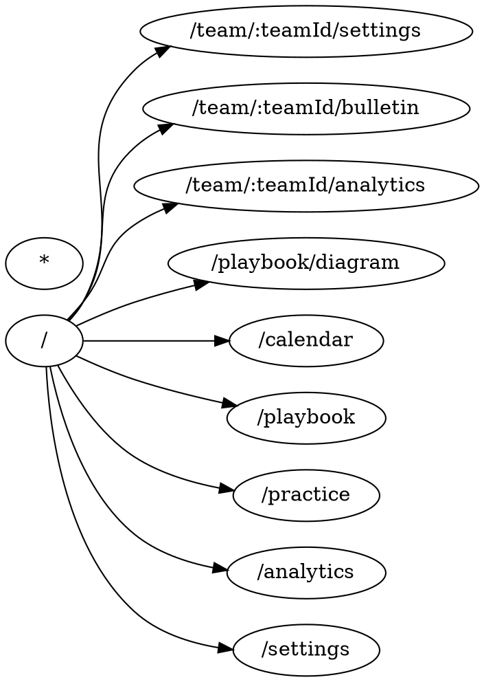

# Codebase Architecture Summary

## Hygiene Overview

- Total findings: 517
- console.log: 335
- TODO: 135
- as any: 22
- eslint-disable: 15
- @ts-ignore: 4

## Architecture

- Circular groups: 57
- Orphan modules: 116
- Module count: 515

## Route Map (DOT)

## Next Actions

- Replace console.log with telemetry/logger abstractions
- Remove eslint-disable and @ts-ignore; address root types
- Break circular deps (if any) by moving shared code to utils/hooks
- Ensure services are consumed via a barrel (`src/services/index.ts`)
